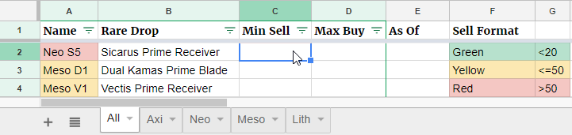
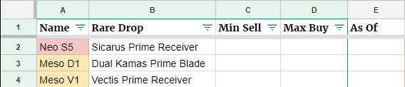

# Relic Valuation

This script is all about Warframe and automating some basic tasks related to the game. Trying to value relics in warframe currently needs you to:
* Get the relic you want
* Find out it's rare drop
* Go to warframe.market and search its rare drop. 

This is cumbersome and thus I have automated the process of looking up the value for each relic. This project was undertaken using Google Sheets and this is simply a dump for the code used since I am too lazy to publish.

## Getting Started

* Make new Google Sheet
* Go to tools > script editor
* Paste code from valueRelic.js
* Go back to sheet and fill in a relics name and rare item drop
* In a separate cell use =valueitem(the_cell)

## Prerequisites

Google Sheets.

## setUpSpreadsheet Method
* Follow getting started section
* Create sheets with the same names and layout as shown: (conditional formatting optional)

* Go to Tools/Script Editor, Select function/setUpSpreadsheet
* Run selected function

## valueItem Method
I laid my table out as such:

In the first cell of the "Min Sell" column I put:

And then double-clicked the bottom corner of the cell to fill out all the rest

## License
I do not own anything, I am not affiliated with Warframe in any way.
